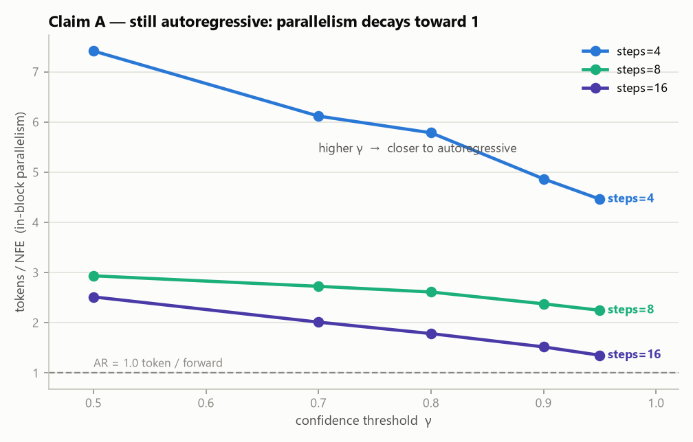
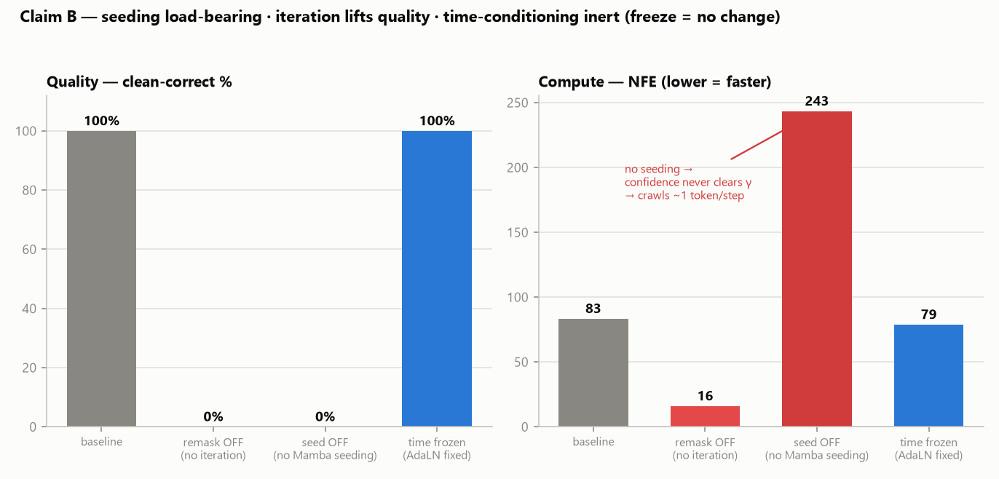
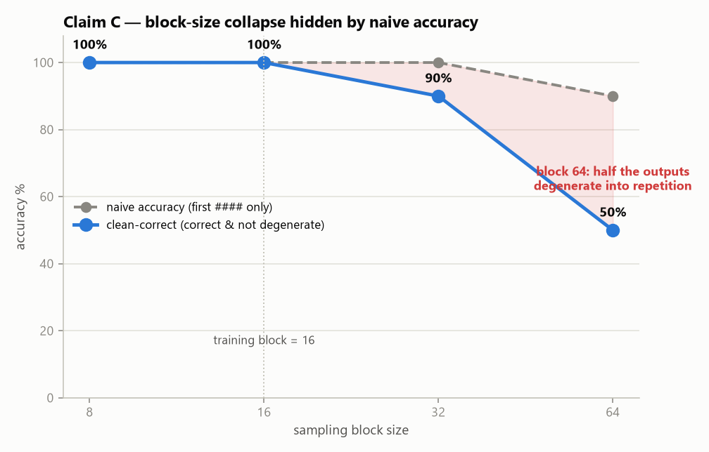
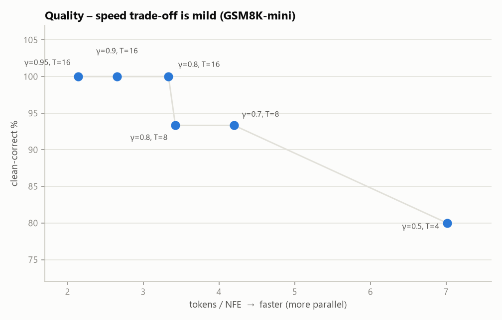
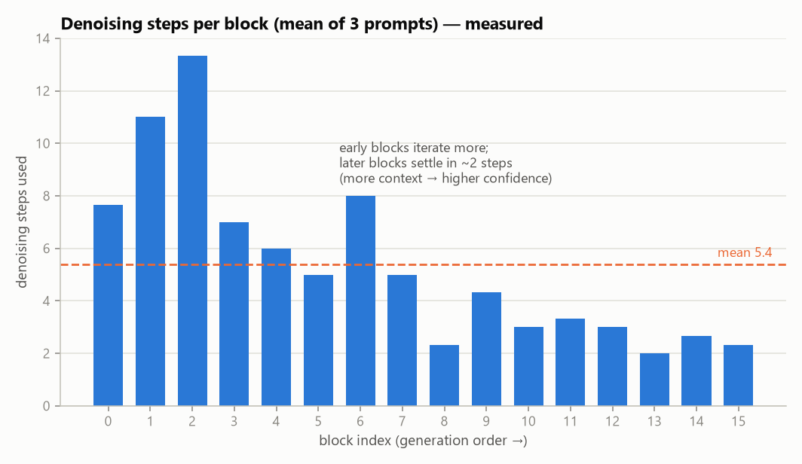
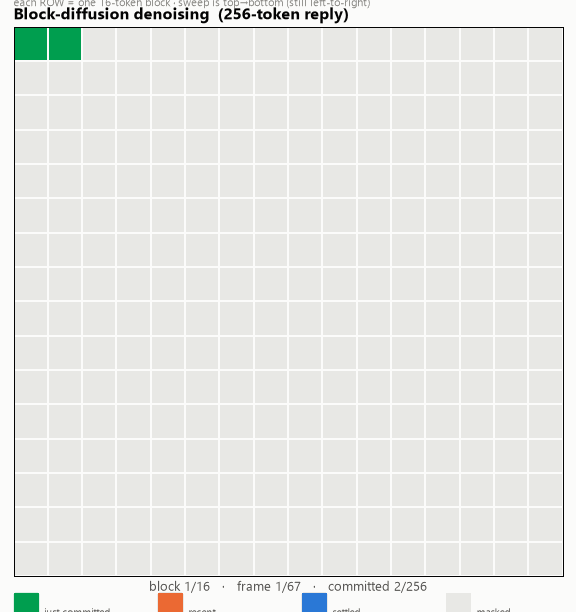
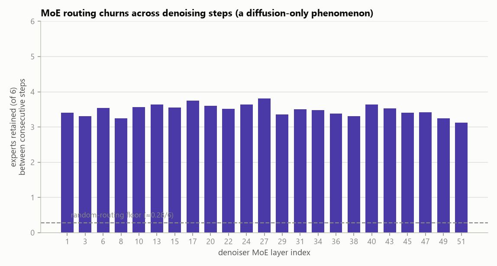

# Nemotron-Labs-TwoTower 深度精读报告

> 组内 paper 精读范例。结构:定位 → 谱系 → 架构 → 改造 → 机制 → 复现发现 → 实验 → 论点。
> **★ = 原创发现/亮点**（非二手可得）。图与数字均来自本机推理侧实验（`make_figs.py` / `make_gif.py`，纯本地无 GPU，读取 `results/*.jsonl` 与 `trace_*.pkl`）。

---

## 0. 核心判断（TL;DR）

> **TwoTower 本质是一个低成本的「块并行 AR 加速补丁」，而不是扩散对自回归（AR）的真正替代。**
> 三条推理侧证据：**(A)** 生成仍强自回归；**(B)** 扩散最具「签名」的时间条件化机制在推理时是惰性的——真正起作用的是「上下文播种 + 块内并行草稿 + 置信度迭代纠错」；**(C)** 采样块尺寸一旦超过训练值即崩溃。

| 指标 | 结果 | 口径 |
|---|---|---|
| 训练配置质量（block16, γ0.8, clean-correct） | **100%** | 修复 kernel bug 后 |
| tokens/NFE（并行度）区间 | **7.4 → 1.35** | γ↑ 越退回 AR 的 1.0 |
| block 64 真实质量 | **50%**（朴素口径 90% 是假象） | 超训练值即崩溃 |
| 去掉 Mamba 状态播种 | 质量 **0%**，NFE 爆到 **243** | 播种通道承重 |
| 冻结 AdaLN 时间条件 | 质量 **100%**（零影响） | 扩散「时间签名」惰性 |
| MoE 路由跨去噪步保留 | **~3.5 / 6** 专家 | 每步 ~40% churn（AR 无法观察） |

---

## 1. 定位与版本

- **论文**：*Nemotron-Labs-TwoTower: Diffusion Language Modeling with Pretrained Autoregressive Context*，arXiv **2606.26493**（v1/v2）。**arXiv-only**，无 OpenReview。
- **定位**：把预训练 AR 骨干**改装（retrofit）**成块级扩散生成器——不是从零训练。复用已有 25T token 预训练的 backbone，只额外训练去噪塔，**AR 塔完全冻结**。
- **模型**：`nvidia/Nemotron-Labs-TwoTower-30B-A3B-Base-BF16`（trust_remote_code）。**唯一发布版：base，无 instruct/aligned**。24 shard，BF16，~118GB。
- **作者/血脉**：Catanzaro / Shoeybi / Patwary（Megatron-LM/Nemotron 核心）；Roger Waleffe（*Mamba-in-Llama*，本文 backbone 血脉）；Fitsum Reda（扩散/视频背景，把扩散经验带进 LLM）。

## 2. 背景与谱系

语言 diffusion 的动机：AR LLM 一次只生成一个 token、推理天然串行；diffusion 想在一段 token 上并行预测、迭代去噪。TwoTower 继承的是经典 **discrete diffusion 脉络（D3PM → MaskGIT → SEDD → MDLM）**，但走了一条和 LLaDA/DiffusionGemma 不同的岔路：**它不训练一个统一网络同时干「表示上下文」和「去噪」，而是把两件事物理拆到两份独立权重上。**

- **直接前身 E2D2**（Arriola et al., NeurIPS 2025, arXiv 2510.22852）：最早提出「编码器表示干净 token、轻量解码器迭代去噪」的两模块思想，但只在 **1.7B、tied weights（绑权重）** 下验证。TwoTower 回答的是：这个解耦思想在 **30B 混合架构、完全解耦（不绑权重）** 时是否成立？
- ★ **NVIDIA 内部路线演进**：还发布过姊妹作 *Nemotron-Labs Diffusion 8B*（联合损失、tied weights）——很可能正是论文 Table 2 里「tied+diffusion 掉 26–28%」的对照组。即：内部先试「联合训练、绑权重」（8B）发现掉质量，再走「完全解耦、分别训练」（30B TwoTower）。这条链是论文没明说、但从 HF collection 结构能推断的。

### 谱系对比表（TwoTower vs LLaDA/iLLaDA vs DiffusionGemma）

| 维度 | iLLaDA / LLaDA | DiffusionGemma | **TwoTower** |
|---|---|---|---|
| 网络结构 | 单一网络 | 单一网络（encoder+decoder 路径） | **两份完整独立权重**（冻结 AR 塔 + 可训去噪塔） |
| diffusion 状态 | `[MASK]` | uniform random token（可重噪） | `[MASK]`（经典 MDLM 同源） |
| block/canvas | 可变 gen_length | 固定 **256**-token canvas | 默认 **16**-token block（小一个数量级） |
| 跨块/步上下文 | 靠 token 序列 | KV cache + **self-conditioning** 软向量 | cross-attn 读 KV + **Mamba 状态播种**（双通道，**但无 self-conditioning**） |
| 块内采样 | mask 位按 confidence 选、低的 remask | 全 canvas 算 entropy、低熵接受、余者**重随机化** | mask 位按 confidence 选（>γ）、低的 **remask 回 `[MASK]`**（不是随机化） |
| 训练 | 从零（masked diffusion） | 未公开（只公开微调 LoRA） | **retrofit：只训去噪塔（~2.1T，≈backbone 8%），AR 塔冻结** |
| 顺序性（实测） | 较强左到右 | τb 0.43–0.60（中等左偏） | 块间严格 AR + tokens/NFE→1（本文实测，见 §7） |

★ **两点值得强调**：TwoTower 是三者里**唯一「物理解耦」**（不共享参数）、也是**训练成本最低**（AR 塔完全不重训）的路线；它比 DG 多一条 Mamba 播种通道（因架构混合），但**缺 DG 的连续 self-conditioning**——跨步只传离散 token + 置信度。

## 3. Backbone 架构：Nemotron-3-Nano-30B-A3B

decoder-only **混合架构**（非纯 Transformer）+ MoE FFN。每塔 52 层，pattern **23 Mamba-2 / 23 MoE / 6 attention**，hidden 2688，vocab 131072，context 最长 262144（256K）。MoE：**128 routed expert / token 激活 6 + 1 shared**（★ 亲手核实纠正：多篇媒体写「2 个 shared」是错的，`config` 是 `n_shared_experts=1`）。

| 模块（单塔） | 参数 | 占比 |
|---|---|---|
| mamba2 ×23 | 0.891B | 2.8% |
| **moe ×23 (total)** | **29.842B** | **94.5%** |
| attention ×6 | 0.140B | 0.4% |
| embed + lm_head | 0.705B | 2.2% |
| **单塔 total / activated** | **31.578B / 3.580B** | — |
| **双塔 total** | **63.2B** | — |

★ **参数几乎全在 MoE（94.5%）**，Mamba/attention 只是轻量「混 token 层」——用 `param_count.py`（零 GPU）从 config 算出。双塔 63.2B 对上 HF 卡的 ~63B。

## 4. 从 AR 到 diffusion 的四处改造

1. **生成单位**：next token → **16-token block**（远小于 DG 的 256——直接决定并行度上限，见 §7 C）。
2. **架构（比 DG 更激进）**：DG 是单网络分出 encoder+decoder 两条路径；**TwoTower 完整克隆两份网络**，一份冻结当 AR 上下文塔、一份训练当去噪塔，两塔**逐层 cross-attention** 协作。
3. **attention**：上下文塔全程 causal；去噪塔「**块内双向（is_causal=False）+ 跨块 causal cross-attention 读上下文塔 KV**」。
4. **上下文传递 = 双通道**：(A) cross-attn 拼接上下文塔 KV；(B) ★ **Mamba 用上下文塔最终状态「播种」（initial_states）**——DG 没有的第二条通道，因为 Mamba 没有 KV cache 概念。
5. **sampler**：next-token → **置信度 commit/remask**（>γ commit、低的 remask 回 `[MASK]`），不是 DG 那种「熵约束联合接受 + 重随机化」。

**机制路线**：TwoTower 走经典 **masked diffusion（MDLM）**——显式 `[MASK]`；不像 DG 的 uniform-state「每个位置永远活着、可持续 refine」。理论上 TwoTower 也有「僵化」风险（高置信度 commit 一旦错就难回改），但 **remask 机制**让低置信度位置还能被打回重猜，比纯 MaskGIT「commit 后永久锁定」稍好。**TwoTower 无 self-conditioning**：跨 step 只传离散 xt + 置信度，跨块靠 Mamba 播种——它靠「上下文塔的强条件」本身就够，不需要 DG 式连续状态传递。

## 5. 数学 / 机制 / 代码接口

- **前向腐蚀**：线性 schedule `α_t = 1 − t`（t=mask 比例）。
- **损失（Eq.4）**：masked diffusion NLL。★ 理论时间权重 **`1/t` 被省略「for stability」**，改优化 masked 位置的平均负对数似然——**破坏 ELBO 严格性换训练稳定，是论文自己承认的「工程 vs 理论」取舍**（数学环节可讨论点）。
- **块自回归分解**：`log pθ(x) = Σ_b log pθ(x_b | x_<b)`。
- **置信度解码「三重保险」**（逐行读代码）：`num_above` = 超 γ 的位置数；`tokens_to_commit = max(num_above 或保底 1, min_commit)`，`min_commit = ceil(剩余 mask / 剩余步数)`；**最后一步强制全 commit**。→ 保证 block 一定在 T 步内填完（不卡死），代价是「必须填完」与「高置信度才填」之间的张力——这正是质量-速度权衡的机制根源。
- **AdaLN-single**（PixArt 风格）：把 mask 比例 t 注入每层 scale/shift/gate，仅 ~1.5M 参数，每 TP rank 复制而非切分。
- **生成接口**（`trust_remote_code`，`modeling_nemotron_twotower.py`）：
  ```python
  generate_mask_diffusion(input_ids, max_new_tokens=128, block_size=16, steps_per_block=16,
      mask_token_id=3, temperature=0.0, confidence_threshold=0.9, ...)  # 核心块扩散
  generate_ar(...)          # AR baseline
  generate_mock_ar(...)     # 调试用
  ```
  函数签名默认 `temperature=0.0, confidence_threshold=0.9`（论文示例与本文实验常用 `temp=0.1, γ=0.8`）。`mask_token_id=3` 由 HF model card 确认（该 tokenizer 无注册的专用 mask token）。

## 6. ★★ 复现中发现并修复的官方 bug（王牌）

**现象**：`generate_ar` 完美（数学题答对），但 `generate_mask_diffusion` / 官方 `generate_mock_ar` 输出**词沙拉**、tokens/NFE 恒为 **1.0**（零并行）、diffusion 比 AR 还慢。

**系统排查**（二分逐一排除，不盲猜）：环境 / 权重加载（`check_weights.py` 确认去噪塔权重已载）/ cross-attn KV / Mamba 播种 / AdaLN / RoPE / attention 实现 / prompt / 采样 / t 方向 / cache 复用——全部排除。**唯一 kernel 差异**：AR 用 `selective_state_update`（不传 initial_states）→ 正常；去噪塔用 `mamba_chunk_scan_combined` + `initial_states` → 垃圾。

**根因（两层）**：
1. **config 层**：论文说 chunk_size 应匹配 block size S=16，但 HF `config.json` 里 **`chunk_size=128`**（继承 backbone 长上下文默认、转换时未对齐）→ 造成 **`block(16) < chunk(128)`**。
2. **kernel 层**：该条件命中 Mamba2 SSD kernel 的一类已知边界 bug（同类见 **vLLM PR #21783**）。

**修复**：把 chunk-scan 换成**逐 token `selective_state_update`**（AR 同款正常 kernel，等价 chunk=1）。数学等价（去噪 Mamba 本就是因果/前向递归，chunk-scan 只是它的硬件并行实现）。换用逐 token kernel 后生成恢复正确，tokens/NFE 从 **1.0（坏）恢复到正常区间**。（注：仅把 `chunk_size` 改回 16 的 fixA 在开源 `mamba_ssm 2.3.2` 上**仍垃圾**，故彻底绕开 chunk-scan。）

**为什么官方没发现**：训练/推理在 Megatron-LM（chunk 匹配 S=16、kernel 实现不同）；转成 HF + 开源 mamba_ssm 才同时踩中「config 未对齐」+「开源 kernel bug」。→ 可给 NVIDIA/HF 报 issue（实打实贡献）。
**「这还是扩散吗？」** ★ 是。并行发生在 (1) 块内双向 attention、(2) 去噪循环一次预测全 16 位 + 每步 commit 多个；Mamba 本是顺序递归，两种 kernel 只是同一递归的两种实现。仅 wall-clock 变慢，**NFE / tokens-per-NFE 这类硬件无关的并行度指标不变**。

## 7. 实验：我做的推理侧消融（论文只做训练侧）

**打分口径**：degeneration-aware——一个 GSM8K 答案只有**既正确、又未退化成短周期重复**（`edededed…` 词沙拉）时才算 **clean-correct**。这一步把 block64 从虚高的 90% 还原成真实 50%。评测集为 15 题**离线合成算术（`synthmath_*`，非官方 GSM8K）**，用于趋势判断。

### 论点 A — 仍是自回归



置信度阈值 γ 越高，`tokens/NFE` 越趋近 **1.0**（AR 的一步一个）：steps=16、γ=0.95 时降到 **1.35**，几乎就是 AR。所谓「并行」是可调表象；加上块间严格 AR、块内 23 层因果 Mamba 主导，**生成本质仍是从左到右的顺序过程**。

### 论点 B（★ 据实验重构）— 播种承重 · 迭代提质 · 时间条件惰性



三个消融一次讲清机制真正靠什么（**注意：这里修正了预注册假设——原以为「关 remask 质量不掉」，实测恰恰相反**）：
- **关闭 remask（不迭代）**：质量 100%→**0%**，NFE 83→16。→ **迭代精修确实在提质量**，一次性并行只出丢字、不收尾的草稿。
- **去掉 Mamba 播种**：质量归零、NFE 爆到 **243**（拿不到上下文，置信度永不达标，退回逐 token 爬行）。→ **播种是承重通道**。
- **冻结 AdaLN 时间条件**：质量**纹丝不动（100%）**。→ 扩散最具「签名」的时间条件化，在推理时**几乎不做事**。

★ **重构后的论点 B**：真正驱动生成的是「**上下文播种 + 块内并行草稿 + 置信度迭代纠错**」，而不是「从噪声按时间表逐步精修」的扩散范式——它更像**带纠错的并行解码**。（`freeze_time` 零影响是这条最锋利的证据。）

### 论点 C — 块尺寸崩溃（朴素准确率会骗你）



采样块从训练值 16 上加，质量单调崩溃：block32 出现 10% 退化，**block64 有一半输出塌成重复垃圾**。灰虚线（朴素准确率，只看第一个 `####`）在 block64 仍显 90%——**它被骗了**（第一个答案恰好对、之后 `edededed…`）。只有 clean-correct（50%）反映真相。与论文 Table 4 代码侧崩溃（HumanEval 76.4→19.85，block16→64）同向。**并行度被训练焊死在块尺寸上。**

### 质量–速度权衡是温和的



训练块尺寸内扫 (γ,T)：质量落在 93–100% 窄带、横跨约 3× 并行度，仅最激进的 γ0.5/T4（7 tokens/NFE）掉到 80%。说明加速主要来自「一次提交多个高置信度 token」，减少迭代步数代价不大——与论点 B 一致。

### 去噪动力学：早块多迭代、晚块秒过



每块实际去噪步数随生成推进下降：**前几块 10–13 步，后面 2 步收敛**（平均 5.4，越往后上下文越多、置信度越易达标）。★ 另一动态发现：**NFE 与题目难度正相关**（三条 trace：nfe 51/70/89，tpn 5.0/3.7/2.9）。

下面 GIF 把过程动起来（每行=一个 16-token 块，自上而下逐块去噪；绿=当前步提交、蓝=已定稿、灰=仍 MASK）：



> *注：GIF 的块顺序与每块步数为实测（`steps_per_block`）；块内填充顺序为示意。*

### MoE 路由：扩散独有的路由抖动



每个去噪塔 MoE 层（128 选 6），**相邻去噪步之间**平均只有 **~3.5/6** 个专家不变——即每步约 **40% 路由在变**（随机基线仅 0.28/6，所以不是噪声、是真实但不稳定的偏好）。**AR 无法观察这个现象**（每 token 只路由一次）；它是「扩散 + MoE」组合独有的稳定性问题。

### 「三篇 DiffusionGemma 分析论文做了什么 vs 我在 TwoTower 上做了什么」

| 分析维度 | DG 侧对应做法 | 我在 TwoTower 上做的 |
|---|---|---|
| commit 顺序是否 AR | Kendall τb（0.43–0.60，非严格 AR） | tokens/NFE 随 γ 趋近 1（论点 A） + 去噪动力学 |
| 固定 block 是否起作用 | 扫 bin 4/8/16/32/64，平滑无突变 | ★ **相反**：S=16 是**训练焊死的硬边界**，超过直接崩溃（论点 C） |
| 并行的真实来源 | accept batch 一次 13–26 token | tokens/NFE 实测 1.35–7.4 |
| 机制贡献 | 未做（纯观察） | ★ **推理侧消融**（remask/播种/时间条件）——论文没做 |
| 实现层 bug | 三篇都没报 | ★★ **chunk-scan kernel bug**（本文独有贡献） |

## 8. 核心论点与诚实边界

> **TwoTower 本质是低成本的块并行 AR 加速补丁，而非扩散对 AR 的真正替代。**

- **a. 没真正抛弃 AR**：块间严格 AR、23 层因果 Mamba 主导、γ↑ 时 tokens/NFE→1（≈AR）。
- **b. 加速来自块内并行 + 置信度纠错，而非「扩散式时间精修」**：`freeze_time` 零影响证明时间条件化惰性；remask/播种才承重。
- **c. 并行脆弱、上限低且被训练焊死**：block>16 采样直接崩溃（复现 Table 4）；理论并行上限=block size（16×），论文实测仅 **2.42×**。

**诚实边界**：
- **AR 相对加速**未在本地跑通（单卡 OOM + pod 丢失），头条 **2.42× / 98.7% 质量保留**引自论文；本文贡献是**机制消融**，不依赖自测 AR。
- **HumanEval 代码任务未跑**，代码侧崩溃引论文 Table 4。
- 评测集是 **synthmath**（非官方 GSM8K）；对象是**唯一发布的 base checkpoint**。
- 承认 2.42× 在低 batch 交互场景有实用价值、训练成本确实低（~8%）——**批判的是「扩散替代 AR」的大叙事，不是否定工程价值**。它更像「用最小代价给 AR 加装的块并行外挂」，而非 DG/LLaDA 那种「重定义生成范式」的路线。

## 9. 关系 / gap / 反思

- **谱系**：LLaDA/块扩散、Mamba-2 SSD（架构 + 本文 bug）、DiT/PixArt adaLN（时间条件）、MDLM（损失）、Nemotron-3-Nano（backbone）、Mamba-in-Llama（Waleffe 前作）、E2D2（直接前身）。
- **gap/方向**：① config `chunk_size` 未对齐（已定位并修）；② 向量化正确 SSD（逐 token 慢）；③ 推理侧消融量化各机制（本文已做）；④ ★ 跨步 MoE 路由稳定性（本文已量化）；⑤ base→instruct 后 diffusion 质量；⑥ 省掉的 `1/t` 权重影响；⑦（对照 DG）self-conditioning 式连续状态对稳定/批量 commit 是否有帮助——TwoTower 没这条通道，是个可提的设计问题。
- **反思/避雷**：★ 系统性二分排查 > 盲猜；「单点 OK/多点崩」= 状态污染或 kernel；拿「已知答案」当探针最快定位；环境 8 坑固化进 `setup/install.sh` + `TROUBLESHOOTING.md`（`--no-deps` 锁 torch、别升 triton、env 装本地盘、权重放 Network Volume、HF_TOKEN 别带非 ASCII）。

---
### Sources
- 论文：https://arxiv.org/abs/2606.26493 · https://arxiv.org/html/2606.26493v2
- 模型：https://huggingface.co/nvidia/Nemotron-Labs-TwoTower-30B-A3B-Base-BF16
- kernel bug 同类：https://github.com/vllm-project/vllm/pull/21783
- 前身：E2D2 arXiv 2510.22852
